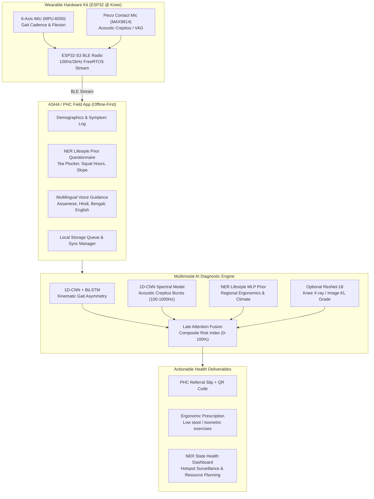

# OsteoNER: AI-Assisted Early Detection System for Knee Osteoarthritis in NER

**Smart India Hackathon 2026**  
- **Problem Statement ID:** `SIH26004`  
- **Title:** AI-Assisted Early Detection System for Osteoarthritis (OA) Risk Markers in North Eastern Region (NER)  
- **Theme:** MedTech / Healthcare  
- **Category:** Hardware + AI Software Suite  
- **Team:** NexGen Minds (Team ID: 129595)  
- **GitHub Repository:** [github.com/dharshininarendrababu-bit/osteo-ner-sih2026](https://github.com/dharshininarendrababu-bit/osteo-ner-sih2026)  
- **Live Prototype URL:** [dharshininarendrababu-bit.github.io/osteo-ner-sih2026](https://dharshininarendrababu-bit.github.io/osteo-ner-sih2026/)  

---

## 📌 Executive Summary & Problem Context

Farmers, tea-garden pluckers, handloom weavers, and hill-community workers across the **North Eastern Region (NER)** face an exceptionally high risk of early-onset knee Osteoarthritis (OA) driven by:
1. **Steep hill terrain walking & heavy basket load carriage** (high eccentric quadriceps strain & joint impact shock).
2. **Floor-level living and prolonged deep squatting (>120°)** for cooking on *chulhas*, floor dining, and sorting tea leaves.
3. **Cold, damp monsoon microclimates** in hill belts accelerating stiffness.
4. **Diagnostic Delay:** OA is traditionally only diagnosed at Kellgren-Lawrence Grade 3/4 after irreversible cartilage loss is visible on standard X-rays. In remote hill districts, tertiary orthopedic centers are hours or days of travel away.

**OsteoNER** solves this by delivering a **low-cost (₹1,850), portable wearable screening kit** (ESP32 + IMU + Piezo Acoustic Contact Mic) combined with **multimodal AI** and an **offline-first multilingual ASHA field app** that detects subclinical pre-radiological cartilage fibrillations (acoustic crepitus) and gait asymmetry *before* visible X-ray damage occurs.

---

## 🏗️ Architecture & Multimodal Pipeline



---

## 🗂️ Project Repository Structure

```
oa-ner-screening-system/
│
├── index.html                   # Zero-dependency, responsive single-page application prototype
│                                # (ASHA workflow, real-time waveform oscilloscope, AI lab, dashboard)
│
├── firmware/
│   └── esp32_wearable_imu_mic.ino  # ESP32 C++ firmware: MPU-6050, Piezo ADC, OLED, BLE Nordic UART
│
├── ai_models/
│   ├── train_multimodal_oa.py   # PyTorch CNN-LSTM + VAG model training and evaluation script
│   └── ner_risk_engine.py       # NER population-specific epidemiological risk weighting engine
│
├── backend/
│   └── server.py                # FastAPI server: /api/screen, /api/sync, FHIR/HL7 referral generation
│
└── README.md                    # Technical documentation and SIH specifications
```

---

## 🚀 How to Run the Prototype

### Option 1: Direct Browser Launch (Instant / Zero-Setup)
1. Double-click or open [index.html](file:///C:/Users/Admin/.gemini/antigravity/scratch/oa-ner-screening-system/index.html) in Google Chrome, Microsoft Edge, or Mozilla Firefox.
2. The interactive prototype includes:
   - **ASHA Field Screening:** Pre-loaded test cohorts (Tea Plucker, Hill Farmer, Handloom Weaver).
   - **Real-Time Sensor & VAG Lab:** Animated 60fps dual-oscilloscope displaying IMU kinematics and high-frequency acoustic crepitus spikes.
   - **Multimodal AI Engine:** Architecture visualization, attention weight breakdown, and validation benchmarks.
   - **NER State Health Dashboard:** Real-time surveillance tracking 28,450+ patients across Assam, Meghalaya, Arunachal, etc.
   - **Printable Referral Slip:** Official NHM / Ayushman Bharat bilingual referral card with verifiable QR code.
   - **Audio Voice Guidance:** Full local-language voice synthesis in **Assamese (অসমীয়া)**, **Hindi (हिन्दी)**, **Bengali (বাংলা)**, and **English**.

### Option 2: Running the Python Backend & AI Training
To start the FastAPI server:
```bash
cd backend
pip install fastapi uvicorn pydantic
python -m uvicorn server:app --reload --port 8000
```
Visit `http://localhost:8000/docs` to inspect interactive Swagger API documentation.

To train the PyTorch multimodal model:
```bash
cd ai_models
pip install torch numpy
python train_multimodal_oa.py
```

---

## 🛠️ Hardware Bill of Materials (BOM)

Total cost per kit is **₹ 1,850**, strictly conforming to the **₹ 1,500 – ₹ 2,000** target in Slide 4:

| Component | Part Description | Approx Unit Cost (INR) | Function |
|---|---|---|---|
| **MCU & Radio** | ESP32-S3-WROOM-1 (Dual-Core 240MHz, BLE 5.0) | ₹ 420 | High-speed sampling, INT8 TinyML inference, BLE radio |
| **Motion Sensor** | MPU-6050 6-Axis IMU (Accel ±4g, Gyro ±500°/s) | ₹ 180 | Gait cadence, stance lag, heel-strike deceleration shock |
| **Acoustic Sensor** | Piezoelectric Contact Mic + MAX9814 Preamp | ₹ 260 | Detects sub-audible cartilage friction & crepitus bursts |
| **Display & Audio** | 0.96" I2C OLED Display + Piezo Buzzer | ₹ 310 | On-device test prompts & instant feedback for ASHA workers |
| **Battery & Power** | 1200mAh Li-ion 3.7V + TP4056 USB-C Charger | ₹ 380 | 14 hours continuous field camp battery life |
| **Casing & Sleeve** | 3D Printed IP54 Enclosure + Neoprene Knee Strap | ₹ 300 | Ergonomic patella mounting, weatherproofing for hill rain |
| **Total Cost** | **Complete Wearable Screening Kit** | **₹ 1,850** | Scalable to < ₹1,200 at production volumes |

---

## 🏆 Key SIH 2026 Competitive Advantages

1. **Pre-Radiological Early Detection:** Identifies micro-crepitus and gait compensation months to years before visible bone joint space collapse on X-rays.
2. **Tailored to North Eastern Demographics:** Specifically models tea plucking head-basket load carriage, steep terrace farming, and prolonged floor-level squatting.
3. **Offline-First Resilience:** Zero reliance on active cellular coverage during village screening camps; auto-syncs when returning to PHC Wi-Fi.
4. **Inclusive Multilingual Voice Interface:** Spoken instructions in Assamese, Bengali, and Hindi eliminate literacy barriers for rural elder workers.
5. **Direct Integration with NHM & Ayushman Bharat:** Exports standard referral slips with QR codes readable at district hospital OPDs.
